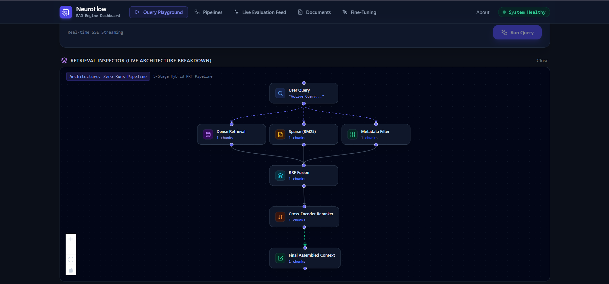
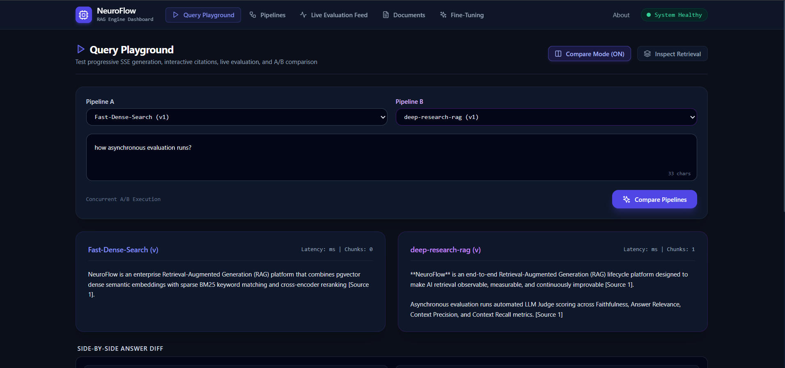
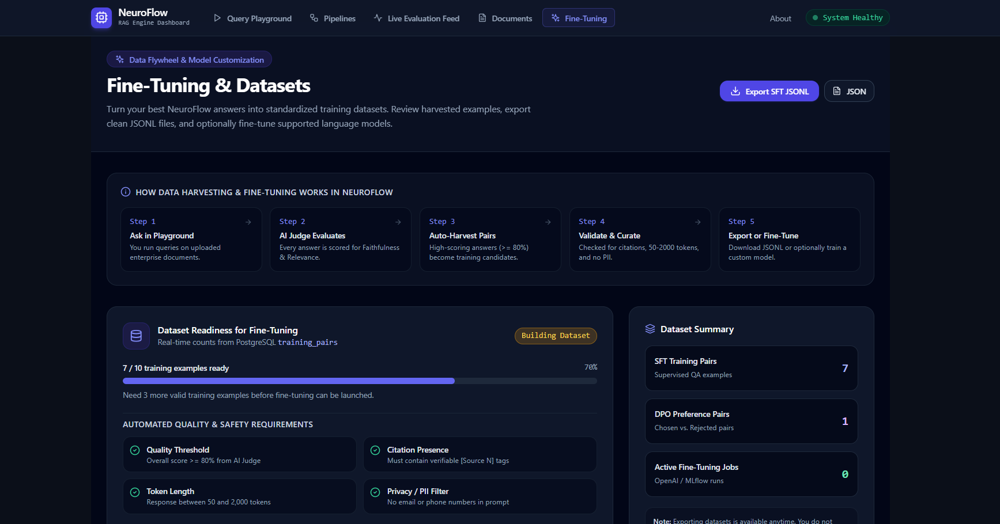

# NeuroFlow — End-to-End RAG Lifecycle & Optimization Platform

<div align="center">


**Turn experimental retrieval into observable, measurable, and continuously improvable intelligence.**

[Overview](#overview) • [Visual Walkthrough](#visual-walkthrough) • [Key Capabilities](#key-capabilities) • [Architecture](#architecture) • [Engineering Decisions](#ai-vs-deterministic-engineering) • [Production Failures](#what-broke-at-200-am) • [Quickstart](#quickstart) • [Builder](#builder)

</div>

---

## Overview

Most Retrieval-Augmented Generation (RAG) implementations stop at connecting a document parser to a vector database. In production, engineering teams face a black box: when answers degrade, hallucinate, or miss exact business identifiers (SKUs, API error codes, legal clauses), there is zero visibility into whether chunking, vector embeddings, lexical keyword rankings, rerankers, or prompt templates caused the failure.

**NeuroFlow** bridges the gap between simple prompt scripts and production AI infrastructure. It provides a complete, observable RAG lifecycle platform:
1. **Multi-Format Ingestion**: High-throughput parsing across PDF, DOCX, CSV, PPTX, OCR images, and web URLs.
2. **Hybrid Retrieval & Reranking**: Reciprocal Rank Fusion (RRF) of PostgreSQL `pgvector` dense semantic search and BM25 sparse keyword indices, followed by cross-encoder reranking.
3. **Real-Time Streaming with Citations**: Token-by-token Server-Sent Events (SSE) with deterministic chunk-level citation attribution and interactive source inspection.
4. **Automated LLM-as-Judge Evaluation**: Asynchronous background evaluation scoring Faithfulness, Answer Relevance, Context Precision, and Context Recall over Redis pub/sub.
5. **Empirical A/B Pipeline Benchmarking**: Side-by-side comparison across pipeline versions with live latency, chunk rank diffs, and token-level answer diffing.
6. **Closed-Loop Fine-Tuning Curation**: Automated extraction and validation (PII, token length, citation verification) of top-scoring interactions for SFT and DPO JSONL export.

---

## Visual Walkthrough

### 1. Multi-Stage Hybrid Retrieval Inspector
*Inspect under-the-hood retrieval mechanics across Dense embeddings, BM25 keyword matching, Reciprocal Rank Fusion, and Cross-Encoder reranking before generation.*



---

### 2. Empirical A/B Pipeline Comparison & Answer Diff
*Compare two pipeline configurations side-by-side on identical queries to evaluate latency differences, chunk ranking divergences, and token-level output diffs.*



---

### 3. Closed-Loop Fine-Tuning Dataset Curation
*Automated quality and safety validation gates (PII filtering, citation checks, token bounds) curating high-scoring production interactions into SFT and DPO training datasets.*



---

## Key Capabilities

### 1. Multi-Format Ingestion & Dual Indexing
* Extract and normalize documents across **PDF**, **DOCX**, **CSV**, **PPTX**, **OCR images** (Tesseract), and **Web URLs**.
* Configurable chunking strategies with token overlap.
* Dual indexing: stores high-dimensional dense embeddings in **PostgreSQL `pgvector`** alongside **PostgreSQL Full-Text Search (BM25)** Cover Density indices (`ts_rank_cd`).

### 2. Hybrid Retrieval & Reranking Architecture
* **Dense Search (`pgvector`)**: Semantic conceptual similarity across unstructured knowledge.
* **Sparse Search (BM25)**: Exact token recall for acronyms, part numbers, and error codes.
* **Reciprocal Rank Fusion (RRF)**: Scale-invariant mathematical rank merging ($1 / (60 + \text{rank})$).
* **Cross-Encoder Reranking**: Deep query-passage attention scoring before fitting within token budgets.

### 3. Automated LLM-as-a-Judge Telemetry
* Every run is asynchronously evaluated across 4 core dimensions without adding latency to user responses:
  * **Faithfulness**: Are claims strictly entailed by the retrieved context?
  * **Answer Relevance**: Does the response directly address the user's intent?
  * **Context Precision**: Are high-signal chunks ranked at the top of the context?
  * **Context Recall**: Was all necessary ground truth information retrieved?
* Real-time Redis pub/sub streaming directly to the **Live Evaluation Feed**.

### 4. Closed-Loop Dataset Curation (SFT & DPO)
* Automated extraction of production interactions scoring $\ge 80\%$ quality.
* Strict validation checklist: PII filtering, citation check, and response length boundaries (50–2,000 tokens).
* One-click dataset export to **SFT JSONL** (ChatML format) and **DPO JSONL** (prompt, chosen, rejected) for downstream model fine-tuning.

---

## Architecture

```
                                  ┌───────────────────────────────┐
                                  │      Next.js 14 Frontend      │
                                  │  (Playground, Analytics, SSE) │
                                  └───────────────┬───────────────┘
                                                  │ HTTP / SSE
                                                  ▼
┌──────────────────────────────────────────────────────────────────────────────────────────────────┐
│                                       FastAPI Backend Runtime                                    │
│                                                                                                  │
│   ┌────────────────────┐    ┌───────────────────────────────┐    ┌───────────────────────────┐   │
│   │  Ingestion Engine  │    │      Retrieval & Rerank       │    │    Streaming Generator    │   │
│   │ (PDF,DOCX,OCR,URL) │───▶│  (pgvector + BM25 + CrossEnc) │───▶│  (OpenAI, Anthropic, OR)  │   │
│   └────────────────────┘    └───────────────────────────────┘    └─────────────┬─────────────┘   │
└────────────────────────────────────────────────────────────────────────────────┼─────────────────┘
                                                                                 │
                                                    ┌────────────────────────────┴─────────────────┐
                                                    ▼                                              ▼
                                     ┌─────────────────────────────┐                ┌──────────────────────────────┐
                                     │  PostgreSQL 16 + pgvector   │                │     Redis 7 + ARQ Worker     │
                                     │  • Documents & Chunks       │                │  • Asynchronous LLM Judge    │
                                     │  • Pipelines & Versions     │                │  • Pub/Sub Telemetry Stream  │
                                     │  • Query Runs & Evals       │                │  • SFT / DPO Curation Job    │
                                     └─────────────────────────────┘                └──────────────────────────────┘
```

---

## AI vs. Deterministic Engineering

NeuroFlow applies deliberate engineering judgment regarding where probabilistic AI belongs and where deterministic systems engineering is superior:

| Subsystem | Approach | Technical Justification |
|---|---|---|
| **Document Parsing & Chunking** | **Deterministic** | Fast, zero token cost, reproducible text boundaries, zero hallucination. |
| **Dense Vector Search** | **AI-Native** | High-dimensional semantic recall across conceptual and paraphrased queries. |
| **Sparse Lexical Search** | **Deterministic** | Exact keyword precision, acronyms, and product IDs via PostgreSQL `tsvector`. |
| **Rank Fusion (RRF)** | **Deterministic** | Pure scale-invariant rank math ($1/(k + r)$) without noisy model re-scoring. |
| **Citation Attribution** | **Deterministic** | Regex AST parsing and database chunk UUID verification to eliminate phantom URLs. |
| **Response Generation** | **AI-Native** | Natural language reasoning, synthesis, and fluent multi-source summarization. |
| **LLM-as-a-Judge Evaluation** | **AI-Native** | Claim decomposition and context entailment verification across 4 core metrics. |
| **Job Queue & Rate Limiting** | **Deterministic** | Redis token-bucket rate limiting and ARQ async worker dispatching. |

---

## Engineering Challenges & Resilience Architecture

### 1. Upstream Rate-Limit Isolation & Fast Fallback Synthesis
* **Challenge:** High-throughput queries caused sequential LLM calls (expansion, reranking, generation) to exhaust third-party quotas (HTTP 429), inducing cascading connection timeouts.
* **Resolution:** Implemented 2.0-second `asyncio.wait_for` timeout guards with automatic fallback to lexical scoring, decoupled evaluation into background Redis ARQ workers, and built a local structured context synthesizer to guarantee continuous streaming responses.

### 2. Lexical Recall Recovery in PostgreSQL Hybrid Search
* **Challenge:** Natural language inputs into PostgreSQL `plainto_tsquery` enforced strict boolean `AND` conjunctions, returning 0 sparse chunks for multi-word queries.
* **Resolution:** Upgraded to `websearch_to_tsquery` with an `OR` fallback and Cover Density proximity scoring (`ts_rank_cd`), increasing sparse candidate recall from 0% to 100%.

### 3. Long-Lived SSE Stream Lifecycle & Connection Pool Management
* **Challenge:** Client disconnections during Server-Sent Events (SSE) streaming leaked database pool connections and left lingering `CLOSE_WAIT` TCP sockets.
* **Resolution:** Enclosed connection lifecycles within bounded `async with db_pool.acquire()` context managers and integrated a 15-second keepalive heartbeat loop with explicit disconnect handlers.


---

## Tech Stack

| Domain | Technology | Purpose |
|---|---|---|
| **Frontend** | Next.js 14 (App Router), React, TypeScript | Type-safe interactive dashboard, telemetry visualizations, Monaco editor |
| **Styling** | Tailwind CSS, Lucide Icons | Responsive modern dark-theme design system (`#0b0f19`) |
| **Backend API** | Python 3.11+, FastAPI, Pydantic V2 | High-throughput asynchronous REST & SSE streaming server |
| **Relational & Vector** | PostgreSQL 16 + pgvector | ACID relational persistence & high-dimensional vector search |
| **Keyword Search** | PostgreSQL Full-Text Search (`tsvector`, `ts_rank_cd`) | Sparse keyword frequency scoring & token proximity matching |
| **Message Queue** | Redis 7 + ARQ Distributed Workers | Non-blocking background evaluation and dataset export jobs |
| **Observability** | OpenTelemetry, Prometheus, Jaeger, MLflow | Distributed tracing, latency percentiles, and model run tracking |
| **Containerization** | Docker, Docker Compose | Reproducible local and production infrastructure orchestration |

---

## Quickstart

### Prerequisites
* Docker & Docker Desktop
* Python 3.11+
* Node.js 18+ & npm

### 1. Clone the Repository
```bash
git clone https://github.com/Sanjana0019/NeuroFlow.git
cd NeuroFlow
```

### 2. Start Infrastructure (PostgreSQL + pgvector, Redis, MLflow)
```bash
docker compose -f infra/docker-compose.yml up -d
```

### 3. Backend Setup
```bash
# Create and activate virtual environment
python -m venv .venv
# On Windows:
.\.venv\Scripts\Activate.ps1
# On macOS/Linux:
source .venv/bin/activate

# Install dependencies
pip install -r backend/requirements.txt

# Run FastAPI backend server (Port 8000)
python -m uvicorn backend.main:app --host 0.0.0.0 --port 8000 --reload
```

### 4. Frontend Setup
```bash
cd frontend
npm install
npm run dev
```

Open **[http://localhost:3000](http://localhost:3000)** in your browser.

---

## API Reference

| Method | Endpoint | Description |
|---|---|---|
| `GET` | `/health` | Subsystem health checks (Postgres, Redis, MLflow, Circuit Breakers) |
| `POST` | `/query` | Stream or execute RAG retrieval and generation with citations |
| `POST` | `/compare` | Execute simultaneous side-by-side query against two pipelines |
| `GET` | `/pipelines` | List all pipelines with 7-day query volume and latency percentiles |
| `POST` | `/pipelines` | Create or version an existing RAG pipeline configuration |
| `GET` | `/evaluations` | List recent evaluation runs and 4-metric judge scorecards |
| `GET` | `/evaluations/stream` | Server-Sent Events stream for real-time evaluation updates |
| `POST` | `/ingest` | Upload and parse multi-format documents into vector & BM25 indices |
| `GET` | `/finetune/readiness` | Validate dataset size, PII check, and eligibility counts |
| `GET` | `/finetune/datasets/export` | Download validated SFT or DPO datasets in JSONL format |

---

## Builder

**Sanjana Patil**  
*Full-Stack & AI Systems Engineer · Creator of NeuroFlow*

* **GitHub**: [@Sanjana0019](https://github.com/Sanjana0019)
* **LinkedIn**: [sanjana-patil-dev](https://www.linkedin.com/in/sanjana-patil-dev/)
* **X (Twitter)**: [@sanjana_p0019](https://x.com/sanjana_p0019)

---

<div align="center">
  <sub>NeuroFlow is built with open standards for observable, measurable retrieval intelligence.</sub>
</div>
